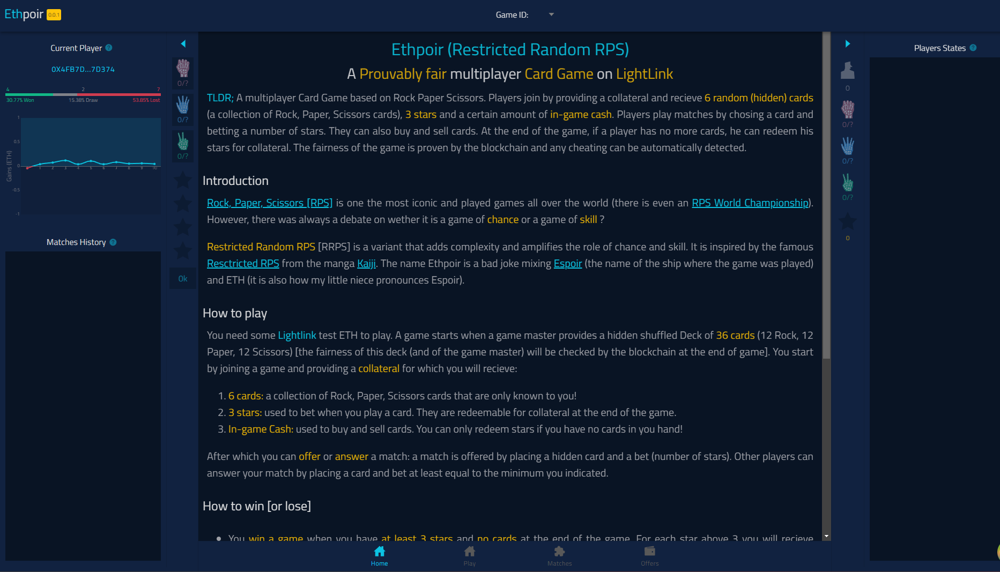
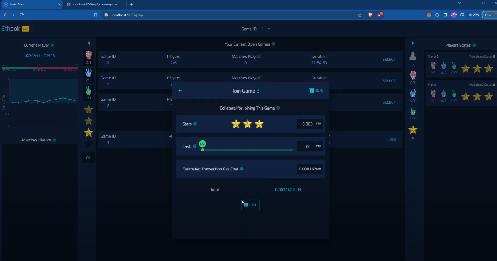
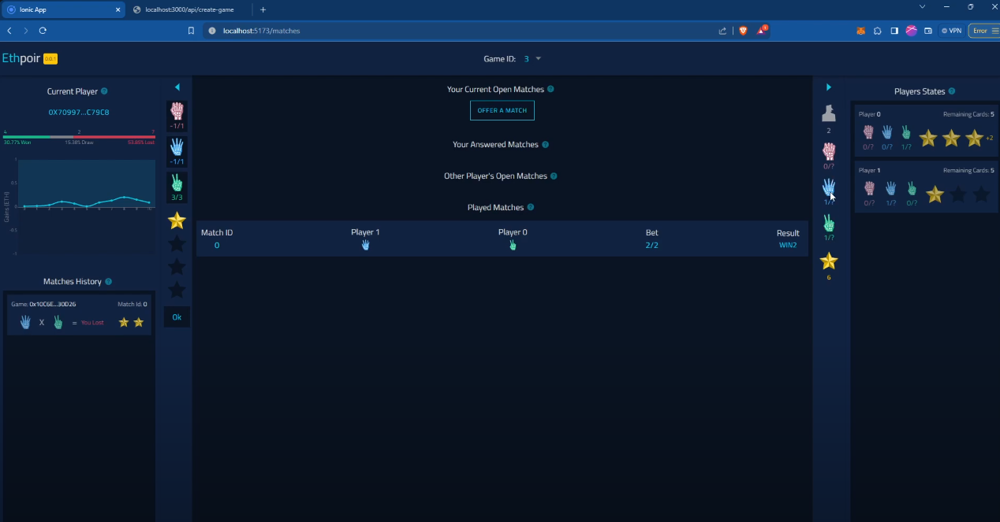

# Ethpoir (Restricted Random RPS)

**TLDR;** A Prouvably fair multiplayer Card Game based on Rock Paper Scissors. Players join by providing a collateral and recieve <em>6 random (hidden) cards</em> (a collection of Rock, Paper, Scissors cards), <em>3 stars</em> and a certain amount of <em>in-game cash</em>. Players play matches by chosing a card and betting a number of stars. They can also buy and sell cards. At the end of the game, if a player has no more cards, he can redeem his stars for collateral. The fairness of the game is proven by the blockchain and any cheating can be automatically detected.

## Links

- [Main Factory Contract](https://pegasus.lightlink.io/address/0x728995bEA7AA626193a1Ae5194188Ac5d3305083)
- [Example of a Game](https://pegasus.lightlink.io/address/0x87b2095d0220F5cD2F1E71bcFD122Ae8B8972824)
- [Demo Video](https://www.youtube.com/watch?v=5mIXBvg7C2U)
- [Presentation](https://docs.google.com/presentation/d/1NLqBMs5poGdPGoexNdt9FHfSR3FSEIhnVAr6JW32ZHY/edit?usp=sharing)

**Disclaimer:** The project does not have a website because it is not fully finished it lacks:

- Game Closing Function automatic call by backend
- Cash Transactions between players
- Redeem stars functionnality has been removed as it is buggy.
- Code Optimisation (even after huge efforts there is still too many calls to the RPC on frontend side)

## Introduction

[Rock, Paper, Scissors [RPS]]("https://en.wikipedia.org/wiki/Rock_paper_scissors) is one the most iconic and played games all over the world
(there is even an [RPS World Championship](https://wrpsa.com/rock-paper-scissors-tournaments/). However, there was always a debate on wether it is a game of <em>chance</em> or a game of <em>skill</em> ?

<em>Restricted Random RPS</em> [RRPS] is a variant that adds complexity and amplifies the role of chance and skill. It is inspired by the famous [Resctricted RPS](https://kaiji.fandom.com/wiki/Restricted_Rock_Paper_Scissors) from the manga [Kaiji](https://kaiji.fandom.com/wiki/Kaiji_Wiki). The name Ethpoir is a bad joke mixing [Espoir](https://kaiji.fandom.com/wiki/Espoir) (the name of the ship where the game was played) and ETH (it is also how my little niece pronounces Espoir).

## How to play

You need some <strong>Lightlink</strong> test ETH to play. A game starts when a game master provides a hidden shuffled Deck of <em>36 cards</em> (12 Rock, 12 Paper, 12 Scissors) [the fairness of this deck (and of the game master) will be checked by the blockchain at the end of game]. You start by joining a game and providing a <em>collateral</em> for which you will recieve:

- <em>6 cards: </em> a collection of Rock, Paper, Scissors cards that are only known to you!
- <em>3 stars: </em> used to bet when you play a card. They are redeemable for collateral at the end of the game.
- <em>In-game Cash: </em> used to buy and sell cards. You can only redeem stars if you have no cards in you hand!
  After which you can <em>offer</em> or <em>answer</em> a match: a
  match is offered by placing a hidden card and a bet (number of
  stars). Other players can answer your match by placing a card
  and bet at least equal to the minimum you indicated.

## How to win [or lose]

- You <em>win a game</em> when you have <em>at least 3 stars </em> and <em>no cards</em> at the end of the game. For each star above 3 you will recieve additional collateral.
- You <em>lose a game </em> when you have <em>less than 3 stars</em> at the end of the game (you will still recieve part of your collateral for each star you have).
- You <em>draw a game</em> when you have more than 3 stars and at <em>least 1 card</em>. You will only recieve the collateral you used.

## Architecture and How it Works

In order for the game to be fair, it is designed without any direct communication between the front-end and the back-end (everything goes through the blockchain).
The challenges of this game arise from the fact that two types of informations need to be hidden when a game is played: the **deck**, and each **player initial hand**. In order to guarantee that no player or game master cheated, these two informations need to be verifiable after each game as to avoid allowing cheaters to take collateral that is not rightfully theirs.

1. **The fairness of the deck:** at the begining of the game, a game master (our backend) provides a hash of an initial shuffled deck. The game requests a random number from API3 QRNG and asks the game master to reshuffle the deck using this number. In order to close a game, the game master will have to provide the secret for the initial deck hash and the smartcontrat will verifiy that after reshuffling the deck with the QRNG every player has indeed recieved the right amount of cards.
2. **The fairness of the Player initial hand:** when a player joins a game, he sends a public key that is used by the game master to encrypt the player's initial hand. The front-end fetches the hash from the blockchain and automatically decrypts it for the player.

The game is composed of two Smart Contracts, a Factory smartcontract that handles game creation and verification, and a Game smartcontract. For every game, the factory smartcontract deploys a new Game smartcontract up to 50, afterwhich, the deployed games are reused if they are finished.

## Technical Stack

- Contracts: Solidity & Foundry
- Backend: Nestjs and Postgresql, Ethers
- Frontend: Ionic React, Wagmi
- Bkockchain: Lightlink Pegasus Testnet

## UI Example

